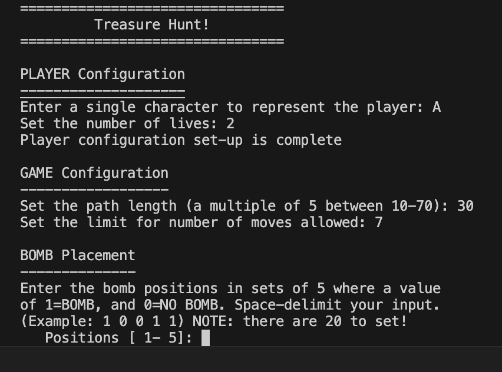

# tressureHunt
A console-based adventure game in C where the player moves along a hidden path. You must explore tiles, collect treasures 💎, and avoid bombs 💣 while managing your limited lives and moves.
Each move uncovers what’s on that tile (nothing, treasure, bomb, or both).
Already visited tiles are marked so you don’t waste moves.
The game ends when you run out of lives or moves.

**How to Run**

gcc treasure_hunt.c -o treasure_hunt
./treasure_hunt

**How to Play**
>Enter a move (choose a position on the path).
>The tile is revealed (treasure, bomb, both, or nothing).
>Keep track of your lives, treasures, and moves left.
>Survive and collect as much treasure as possible.

